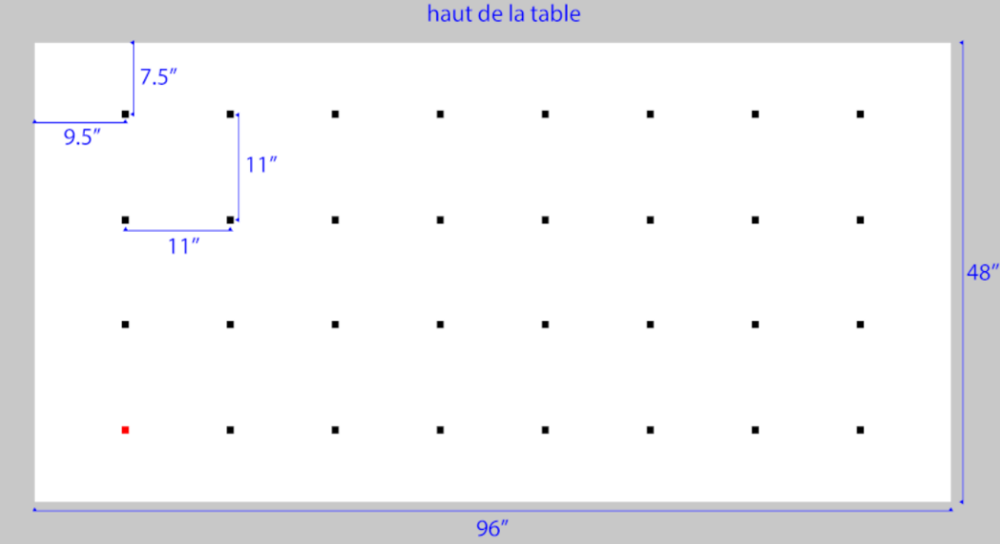

# Embedded-Systems-Project
Building of a hardware and software system based on an ATmega324 microcontroller board.

# Project setup :
Before commencing the main project, a library has been developed to provide a collection of essential functionalities that may prove useful. This library encompasses various functions for controlling different components of the robot, including the LED, wheels, sound, timer, memory, RS232, and more.

By utilizing this library, you can leverage pre-built functions to efficiently control and interact with the robot's components, streamlining the development process for your project.

# Project description :

This project aims to detect multiple poles placed at specific locations on a table and generate an SVG image that represents the pole locations. The robot will operate in two modes: detection mode and transmission mode.

In the detection mode, the robot will identify and save the positions of the poles placed on the table. It will approach each pole, stopping approximately 15cm away, while emitting a low sound to indicate successful detection. This process will be repeated for 5 to 8 poles. When no more poles are detected, the robot will emit a high-pitched sound to signal the end of the detection mode.

In the transmission mode, the robot will draw an SVG image based on the collected pole coordinates. The image will include the table layout with all possible pole locations and a convex envelope encompassing the detected poles. The robot will transmit this SVG image to a connected computer via a USB cable.

To display the SVG image on the computer, a Python script should be used in conjunction with the robot.

Please refer to the provided image for visualization of the tables and potential pole locations.

